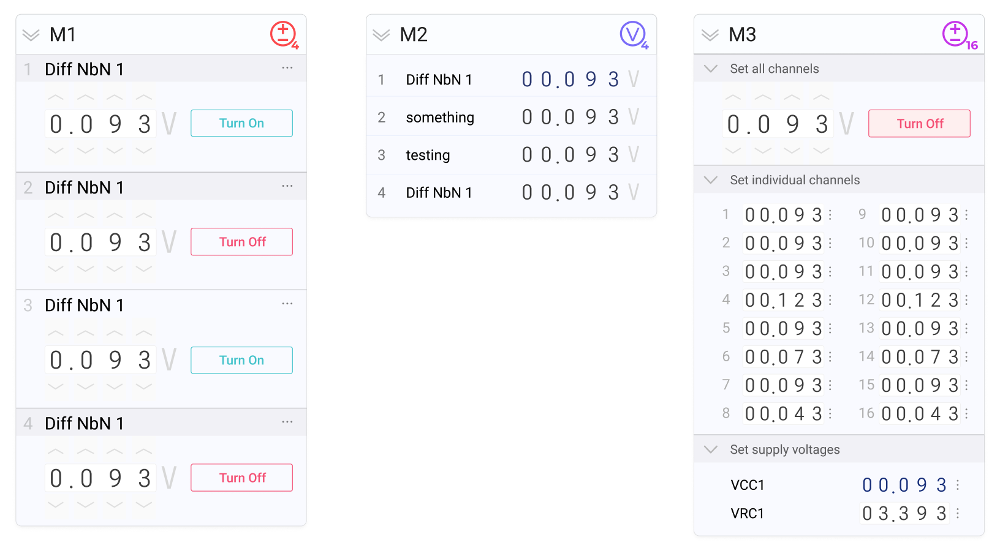

# Device Bay

  

Repository for the Device Bay (DBay) Electronics System

See the `README.md` files in the subfolders for detailed information.

<a href="https://github.com/bkorzh/dbay/releases/tag/v0.1.2">> Install the Device Bay user interface</a>

Device Bay is an open-source mainframe for test & measurement electronics modules. It is ideally suited for operation and testing of cryogenic detectors like SNSPDs, and offers an alternative to proprietary electronics test equipment.

Modules communicate with a PC over USB or ethernet, and may be monitored and controlled with the accompanying installer. Each supported hardware module (voltage source, voltmeter, etc) has an accompanying control interface in the controller software.

