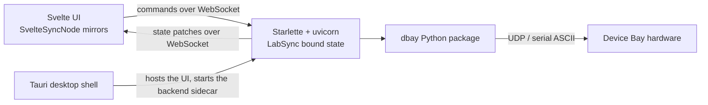

# Architecture

How the pieces talk to each other. Read this when you need to change behaviour rather than just run the app; for setup, see [[Start Here]], and for directory layout, [[Repository Tour]].

The stack is:

- **Svelte** for the frontend
- **Starlette** served by **uvicorn** for the backend
- **[lab-link](https://github.com/sansseriff/lab-link)** for state synchronization between the two
- **Tauri** for the desktop shell
- **PyInstaller** for packaging the backend as a standalone executable

## The central idea: one authoritative state tree

The backend owns a single Pydantic model of the whole rack — `SystemState`, holding eight module slots — and lab-link binds it:

```python
sync = LabSync(persist=PERSIST_ENABLED, db_url=f"sqlite:///{PERSIST_DB_PATH}")
sync.bind_state(global_state.system_state)
```

Once bound, every attribute and list mutation anywhere in that tree is validated, batched, and broadcast to connected clients as a patch. There is no second copy of the state kept in agreement with the first, and no set of REST endpoints that serialize state on demand. Server code changes a Python attribute; connected UIs update.

The frontend mirrors the same tree. Classes like `dac4D`, `VsourceAddon`, and `system_state` extend `SvelteSyncNode` from `lab-link/svelte`, each bound to a JSON-pointer path into the shared state (`/data/3/vsource/channels/0/bias_voltage`, and so on). Incoming patches land in Svelte 5 runes, so the UI reacts without any manual fetching or polling.

Because the module state models are defined once in `software/client/dbay/state.py` and imported by the backend, the Python side, the persisted database, and the TypeScript interfaces all describe the same shape.

## Why lab-link instead of a REST API

The GUI used to be a FastAPI backend with REST endpoints — `/full-state`, `/initialize-vsource`, one route per module action — and a frontend that kept its own copy of the state and refetched. [lab-link](https://github.com/sansseriff/lab-link) replaced that, and it is worth knowing why, because the reasoning explains most of the code you will read.

Lab control software has an awkward shape. The hardware is attached to one computer and only one process can own it, but a browser GUI wants to control it, scripts want to automate it, and a second laptop across the lab wants to watch a measurement in progress. Every one of those viewers has to agree about which channels are on, what the setpoints are, and what the last reading was.

REST made each of those a separate problem to solve by hand:

- **Two copies of the state, kept in agreement manually.** The backend had its models, the frontend had its mirror, and each new field meant editing both plus the code that copied between them. Drift was a matter of when, not if.
- **An endpoint per action.** Every new module type or control meant new routes, new request models, and new client functions — boilerplate proportional to the size of the rack rather than to the interesting behaviour.
- **Polling for anything live.** Continuously sampled values, like the adc4D's readings, had to be pulled on a timer. Poll slowly and the UI lags; poll quickly and you spend the connection on unchanged data.
- **No shared truth between clients.** A change made in one browser tab, or by a Python script, was invisible to everyone else until they happened to refetch. With hardware that actually drives current into a detector, a stale UI is worse than an ugly one.
- **Errors with nowhere to go.** An out-of-range voltage came back as an HTTP status and a string, and each call site invented its own way to show it.

lab-link's answer is a single rule: there is exactly one authoritative copy of the state, and it lives in the Python process that owns the hardware. Everyone else holds a replica the server keeps current, and asks the server to make changes. In practice that means:

- state is a Pydantic tree, and mutations are broadcast as JSON Patches against JSON Pointer paths — so the wire format is diffs of a document you already have, not bespoke payloads
- new fields need no transport code at all; adding one to a model is the whole change
- live values push instead of being polled, because the server sends a patch when the value changes
- every client — browser tabs, the Python client in GUI mode — receives the same patches, so they cannot disagree
- writes are named commands with structured errors that carry a path, severity, and display mode, which is why the frontend can put a message next to the exact field that caused it

The trade-offs are real. A WebSocket is stateful, so there is reconnection and version handling to get right (lab-link owns that, but it is not free). You cannot inspect a value with `curl` the way you could with a REST route. And because backend and frontend speak one protocol, the Python `lab-link` and npm `lab-link` versions must stay aligned — treat them as a single dependency with two halves.

lab-link's own [how it works](https://sansseriff.github.io/lab-link/how-it-works/) page goes deeper on the protocol and the reactive engine.



## Server routes

The whole HTTP surface is three routes, defined in `backend/backend/main.py`:

| Route | Purpose |
| --- | --- |
| `/sync/ws` | the lab-link WebSocket: state patches out, commands in |
| `/` | serves `index.html` from `compiled_frontend/` |
| `/assets` | serves the compiled JS and CSS |

The last two only matter for a packaged app or when the backend serves a built UI directly. During browser development, Vite serves the UI and the only route in use is `/sync/ws`. CORS is configured for `localhost:5173`, `localhost:4173`, and `tauri://localhost`.

## Changes flow back as commands

Reads are patches; writes are named commands. The backend registers handlers with a decorator:

```python
@sync.command
def set_dac4d_vsource(ctx: CommandContext, **params):
    ...
```

Server-wide commands live in `backend/server_api.py` (`initialize_module`, `initialize_vsource`, `get_server_info`), and per-module commands live alongside each module in `backend/modules/` (`set_dac4d_vsource`, `set_dac16d_vsource`, `set_dac16d_vsb`, and so on).

The frontend calls them through `src/api.ts`, which wraps `syncRuntime.sendCommand` and unwraps the acknowledgement:

```ts
syncRuntime.sendCommand<T>(command, params).then(ack => ack.result)
```

A handler that succeeds mutates the bound state — and that mutation is what updates every connected UI, including the one that sent the command. The command's return value is an acknowledgement, not the state update.

### Errors are structured, not strings

Handlers raise `CommandError` with a code, a message, an optional JSON pointer to the offending field, and instructions for how to surface it:

```python
raise CommandError(
    code="voltage_out_of_range",
    message=f"{change.bias_voltage} V is outside the allowed range.",
    display="banner",      # or "toast", or "inline"
    severity="error",      # or "warning", or "info"
    path=ptr("data", module_index, "vsource", "channels", index, "bias_voltage"),
    recoverable=True,
)
```

The frontend routes them in `src/sync/errors.svelte.ts`: banners go to a single top-level slot, toasts stack, and `inline` errors are filed by path so a component can show the error next to the field that caused it. When you add validation, prefer this over a bare exception — the UI already knows what to do with it.

## Connecting

`src/sync/runtime.svelte.ts` decides the WebSocket URL:

- during Vite development, or inside Tauri, it connects to `ws://127.0.0.1:8345/sync/ws` — a fixed backend on a known port
- when the page was served by the backend itself, it uses the page's own origin, so a remote browser pointed at the rack machine works without configuration

`autoConnect` is off, so the app connects explicitly at startup; command timeout is 10 s.

## Reaching the hardware

Command handlers do not talk to hardware directly. Each occupied slot has a controller (`backend/modules/dac4D_controller.py` and siblings) which delegates to the `dbay` package in direct mode, which sends ASCII commands over UDP or serial. `backend/module_registry.py` is the single table that ties a module type string to its state model, its prototype factory, and its controller class.

The `dev_mode` flag and the rack's address come from `backend/config/vsource_params.json` at startup, and `initialize_vsource` can change them at runtime.

## Persistence

`LabSync` is constructed with `persist=True` and a SQLite URL, so the bound state is durable across restarts. On startup, `restore_hardware_bindings()` reattaches controllers to whatever modules were configured before.

State that describes the *hardware's* condition is deliberately not trusted across a restart: `_reset_transient_flags` clears channel `activated` and `measuring` and zeroes sense readings, keeping layout, names, and setpoints. The software cannot know whether an output is live, so it never claims one is.

## Development launcher

`software/gui/frontend/develop.ts` starts both halves:

```bash
# backend, from software/gui/backend
uv run uvicorn backend.main:app --port 8345 --host 0.0.0.0 --reload --reload-dir backend

# frontend, from software/gui/frontend
bun run dev        # Vite on port 5173
```

Two details matter if you run the backend yourself. The working directory must be the `uv` project root (`software/gui/backend`), because the app is imported as `backend.main:app`; and `--reload-dir backend` keeps the file watcher off `.venv`. Running `python backend/main.py` from inside the package directory is not a supported entry point and produces confusing import errors — use the uvicorn command above, or `uv run python -m backend.main` from the project root if you want no reloading.

## Packaged desktop app

In a release build the same backend runs as a bundled executable rather than from your virtual environment:

- the frontend is built to static assets and copied into `backend/backend/compiled_frontend/`
- PyInstaller packages the backend as `dbaybackend`
- Tauri bundles that executable as a sidecar under `src-tauri/resources/`
- `src-tauri/src/main.rs` launches it when the window opens and kills it on exit

So the packaged app is the same architecture as development, with the UI served by the backend instead of Vite. See [[Building and Packaging]].

## Main entry points

| File | Role |
| --- | --- |
| `software/gui/backend/backend/main.py` | Starlette app, routes, lifespan |
| `software/gui/backend/backend/sync.py` | `LabSync` instance, state binding, persistence, restore |
| `software/gui/backend/backend/module_registry.py` | module type → state model, prototype, controller |
| `software/gui/frontend/src/sync/runtime.svelte.ts` | the frontend's sync runtime and WebSocket URL |
| `software/gui/frontend/src/state/systemState.svelte.ts` | the mirrored system state |
| `software/gui/frontend/develop.ts` | development launcher |
| `software/gui/frontend/build.ts` | build and packaging orchestration |
| `software/gui/frontend/src-tauri/src/main.rs` | desktop shell, backend sidecar lifecycle |

## The Python client as a consumer

`software/client/` is also a client of this architecture. In GUI mode it connects to `/sync/ws` like the frontend does, receiving the same patches and sending the same commands, which makes scripted control and the UI interchangeable. In direct mode it skips the backend entirely and drives the hardware over UDP or serial. See the package's own `README.md`.
