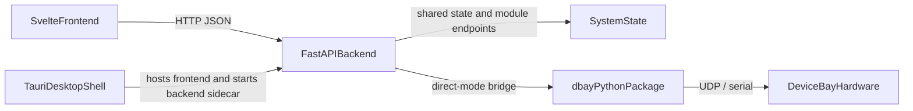

# Software Frontend and Backend

Device Bay software is split into a reusable Python client package and a GUI application stack.

The GUI stack uses:

- Svelte for the frontend
- FastAPI for the backend
- Tauri for the desktop shell
- PyInstaller for packaging the backend executable

## Software Layout

```folder
software/
├── client/
│   ├── dbay/
│   ├── README.md
│   └── pyproject.toml
└── gui/
    ├── backend/
    │   ├── backend/
    │   ├── pyproject.toml
    │   └── uv.lock
    ├── frontend/
    │   ├── src/
    │   ├── src-tauri/
    │   ├── build.ts
    │   ├── develop.ts
    │   └── package.json
    ├── build.sh
    ├── dev-browser.sh
    └── dev-tauri.sh
```

## What Each Part Does

### `software/client/`

This is the reusable Python `dbay` package.

It supports two usage styles:

- GUI mode: talk to the FastAPI backend over HTTP
- direct mode: talk to the hardware directly over UDP or serial

The GUI backend also uses this package internally, so it is not just an external SDK.

### `software/gui/frontend/`

This contains:

- the Svelte user interface
- the Bun and Vite development workflow
- the Tauri desktop application wrapper in `src-tauri/`

During browser development, the frontend runs on the Vite dev server.

During packaged builds, the compiled frontend assets are copied into the backend's static asset directory so the backend can serve them.

### `software/gui/backend/`

This contains:

- the FastAPI server
- the shared backend state models
- module routers and module-specific controller logic
- PyInstaller packaging configuration

The backend is the source of truth for the current system state and exposes the HTTP API used by the frontend.

## Runtime Architecture



### Browser Development

Here, "browser development" means the frontend is served by Vite during development and opened in a normal web browser, while the backend runs separately as an API server.

- `software/gui/frontend/develop.ts` starts the FastAPI backend on port `8345`
- the same script then starts the Vite dev server on port `5173`
- the frontend talks to the backend over HTTP
- this path does not require a prebuilt static frontend, because Vite serves the UI directly

### Tauri Development

- the same development script starts the backend
- Tauri opens a native desktop window using the frontend code
- the Tauri shell is only needed for desktop app work

### Packaged Desktop App

- the frontend is built into static assets
- the backend is packaged into a standalone executable with PyInstaller
- the Tauri app bundles that backend executable as a sidecar
- `src-tauri/src/main.rs` starts the bundled backend when the desktop app launches

### Backend Static Serving

When the backend serves the UI directly, it expects built frontend files to exist in:

- `software/gui/backend/backend/compiled_frontend/`

That directory is populated by the frontend build step.

Until that build has been run at least once, the backend does not have the compiled `index.html` and asset files it needs to serve the UI directly.

This is why a developer who runs the backend outside the normal browser-dev workflow can see missing-assets errors or a blank page.

## Main Entry Points

- `software/gui/frontend/package.json` defines the frontend, development, and build scripts
- `software/gui/frontend/develop.ts` is the main development launcher
- `software/gui/backend/backend/main.py` is the FastAPI entrypoint
- `software/gui/frontend/src-tauri/src/main.rs` is the native desktop entrypoint

## Supported Backend Startup

For normal development, prefer:

- `software/gui/dev-browser.sh`
- `software/gui/dev-tauri.sh`

If you need to start the backend manually, use the FastAPI entrypoints that the project already relies on, for example:

```bash
cd software/gui/backend/backend
uv run fastapi dev main.py --port 8345 --host 0.0.0.0
```

Running `python software/gui/backend/backend/main.py` directly is not the supported workflow and can produce import-path errors that do not occur with the package-aware FastAPI commands.

## State and API Model

The frontend uses `software/gui/frontend/src/api.ts` to call backend endpoints such as:

- `/full-state`
- `/initialize-vsource`
- `/server-info`

The backend keeps the shared system state in Pydantic models under `software/gui/backend/backend/`.

Module-specific HTTP routes are registered in `main.py`, and the available module types are centrally registered in `software/gui/backend/backend/module_registry.py`.

There is also a helper script at `software/gui/backend/backend/pydantic_to_typescript.py` for generating TypeScript interfaces from some backend Pydantic models used by the frontend addons.

## Build and Packaging Flow

### Frontend Build

`software/gui/frontend/build.ts --frontend`:

- runs `vite build`
- copies the built assets into `software/gui/backend/backend/compiled_frontend/`

### Backend Build

`software/gui/frontend/build.ts --backend`:

- runs PyInstaller inside `software/gui/backend/`
- creates the packaged backend executable

### Tauri Build

`software/gui/frontend/build.ts --tauri`:

- moves the packaged backend into `software/gui/frontend/src-tauri/resources/`
- builds desktop installers with Tauri

### Build Wrapper Script

For macOS and Linux, use:

- `software/gui/build.sh`

It is a thin wrapper around the existing Bun scripts in `software/gui/frontend/package.json`.

Examples:

```bash
./software/gui/build.sh frontend
./software/gui/build.sh backend
./software/gui/build.sh tauri
./software/gui/build.sh all
```

Use these targets as follows:

- `frontend` builds the web UI and populates `software/gui/backend/backend/compiled_frontend/`
- `backend` packages the backend with PyInstaller
- `tauri` builds the Tauri installers
- `all` runs the frontend, backend, and Tauri build flow in sequence

If you want the FastAPI backend to serve the built UI directly, run the `frontend` build first.

## Development Entry Points

For day-to-day development, use:

- `software/gui/build.sh` for macOS and Linux build tasks
- `software/gui/dev-browser.sh` for browser-based development on macOS and Linux
- `software/gui/dev-tauri.sh` for Tauri development on macOS and Linux
- the underlying Bun scripts directly on Windows or when you want finer control

## Next Guide

This page is only a high-level software overview.

The detailed guide for creating a brand new custom module should live separately, after the development environment and architecture docs are stable.
